# Treachery Web App

 

https://treacheryonline.web.app 

A web app for a board game based on Deception: Murder in Hong Kong

# Gameplay

## Forensic Scientist

1. **Create a game**: Go to https://treacheryonline.web.app and click "Create Game"

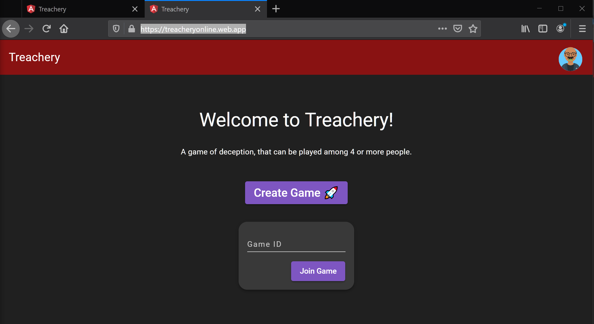

2. **Invite your friends to join the game**: Either copy the link on the start screen, or share the game code which your friends can enter on the home page to join.

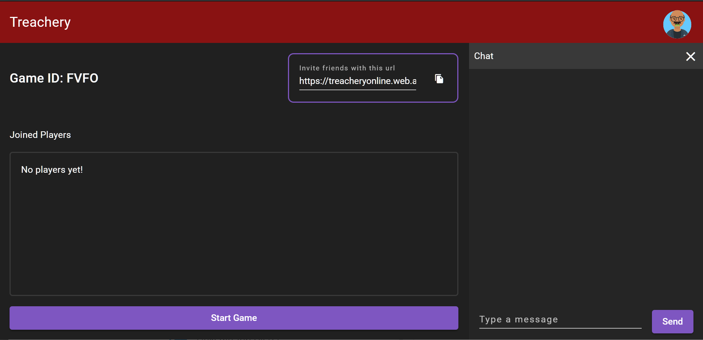

3. **Start the game**: You will need at least three people (excluding you, the Forensic Scientist) to start the game. When ready, click "Start Game"

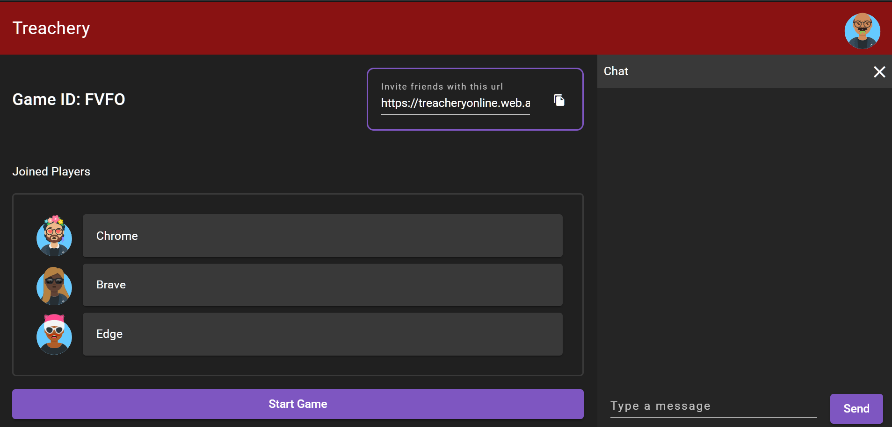

4. **Wait for murderer to select their cards**: The game distributes cards among all players randomly. Each player gets 4 means cards and 4 clue cards. One person out of the players is selected to be the murderer. Only you know his identity, and you are not allowed to reveal it. (Note that chat is disabled). The murderer is prompted to select one clue card and one means card from the cards that he is dealt out.

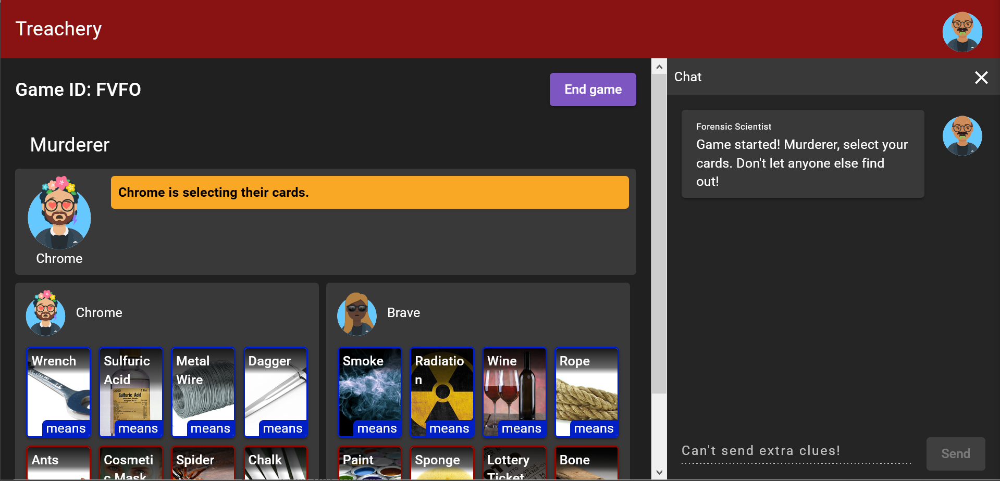

5. **Round 1 of clues**: You will be presented with cards that you can use to give clues to the Investigators to figure out who the murderer is. For each card, select one of the options and click "Select ___ card" to finalize your selection. The first card, the Cause of death card is fixed. For the second card, you get a choice among different Location cards. Choose whichever one you think would fit best. For the rest of the cards, they're selected randomly. In the first round, you should select a total of 6 cards. After selection is complete, start a timer for Investigators to discuss among themselves. Ideally, Investigators should be on a voice call, but you may also use the text chat function provided by the app. (You're not allowed to reveal who the murderer is, or any clues other than the cards you selected.). The discussion timer can be anything you decide, for instance 2:00 minutes. After the 2:00 minutes for discussion is over, each Investigator gets 30 secs uninterrupted to speak their case for who they think it is and why. After this is over, we move on to round 2.

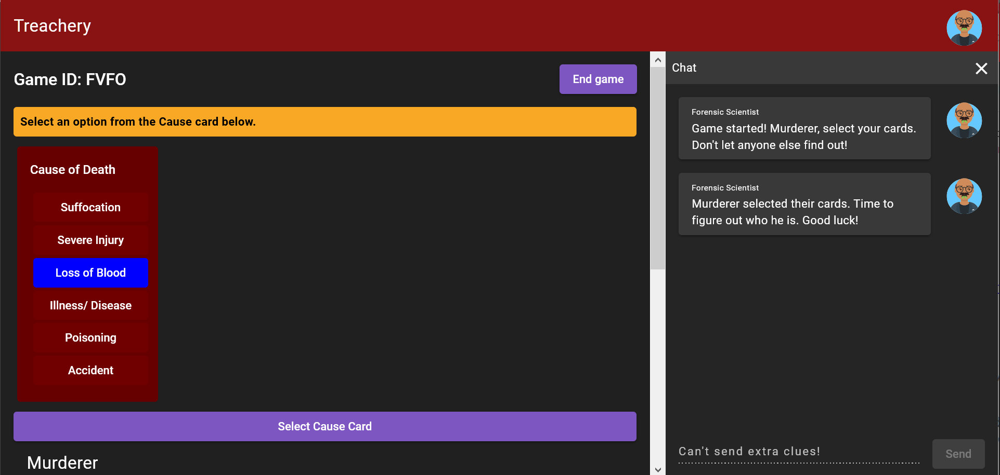

6. **Round 2 & 3 of clues**: You will now randomly be dealt another card, which you can use to replace one of the existing cards. After making this replacement, start a timer again for investigators to discuss, say 2:00 min, followed by each Investigator getting 30 seconds interrupted to present their case. Repeat this for round 3.

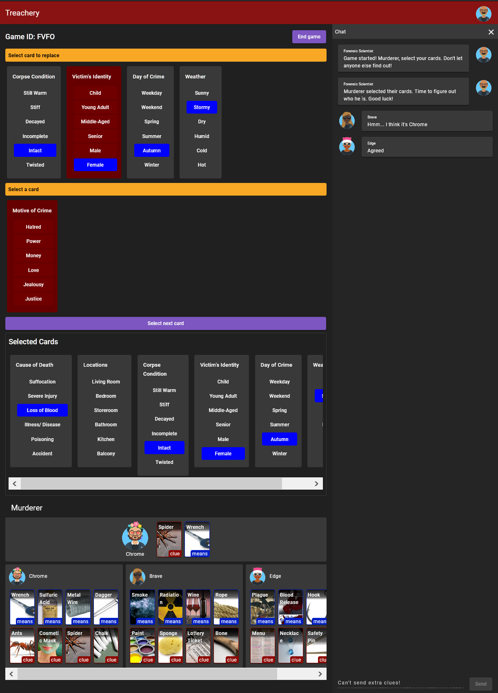

7. **Ending the game**: If no one correctly guesses who the murderer is before the end of round 3, you must end the game. The murderer wins. At any point, if an investigator submits the correct guess, the game also ends and the Investigators win.

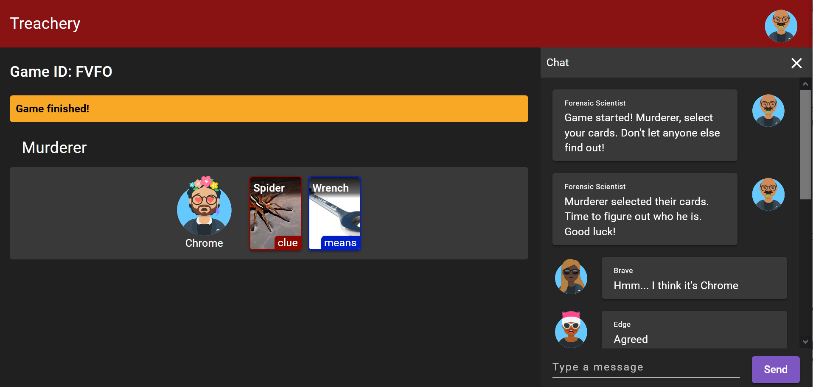

## Player

1. **Joining the game**: Either use the link shared by your investigator or enter the game code shared by the investigator on the home page https://treacheryonline.web.app to join the game. This should take you to a screen to join the game. Enter your Nickname, and click "Join Game" to join. This takes you to the lobby.

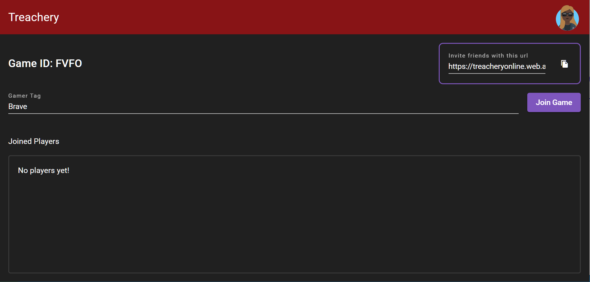

2. **Lobby**: You can see the players that have joined the lobby, you may use the chat function to talk to people in the lobby now. You will have to wait for your Forensic Scientist to start the game. The lobby needs at least 3 people for the Forensic Scientist to do so. After the forensic scientist starts the game, you will find out if you're an Investigator or a Murderer.

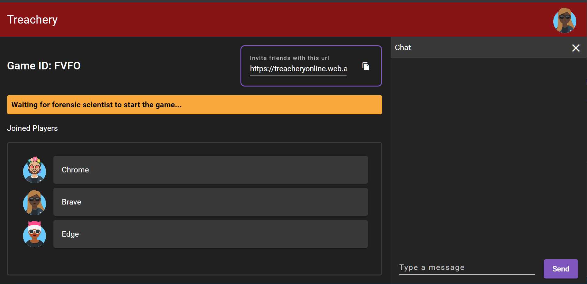

## Investigator

1. **Start screen**: After the Forensic Scientist starts the game, you will see that "Murderer is selection their cards". You can see all the players and what cards they have here. One of the other players is the Murderer and is selecting one Means Card and one Clue card right now. Your objective along with the other investigators is to find out who the murderer is along with correctly guessing both their cards. Your forensic scientist will give out clues for you to figure this out.

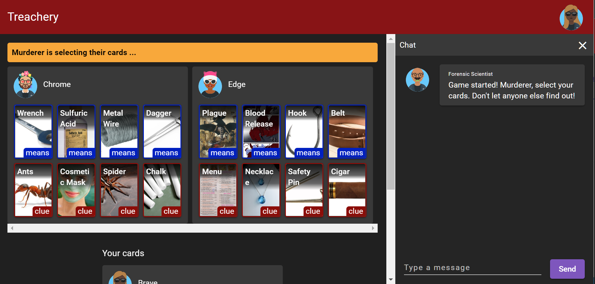

2. **Clues**: Once the murderer has selected their cards, the Forensic scientist will start selecting clues to point to who the murderer is. You may discuss amongst yourselves to what you think the clues mean and who they point to. The clues your Forensic Scientist select will appear at the top of your screen.

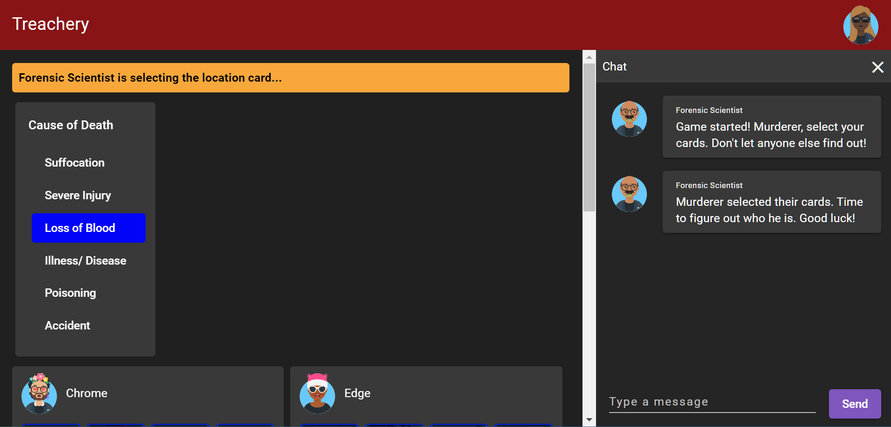

3. **Making a guess**: At any point in the game, after the murderer has selected their cards, you may submit your guess to who the murderer is along with the clue card and means card they selected. To do this, select a clue card and a meas card for one of the players by clicking the two cards, you will see a guess composer popping up below the players list. If you're sure you want to guess, click "Make guess". Keep in mind that you only get one guess per game, so use your guess wisely.

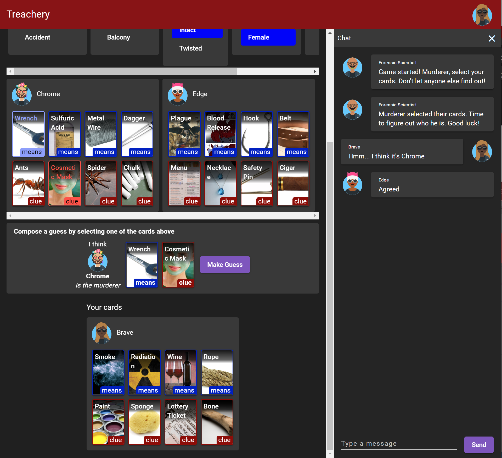

4. **Round 1**: Your forensic scientist will initially select 6 cards, here Round 1 begins and the Forensic Scientist gives you a set time to discuss amongst yourselves to who you think the murderer is. Use this time wisely. At the end of the discussion time, you will all get 30 seconds uninterrupted to present your case for who you think the murderer is, or why you're not the murderer. Round 1 ends here. 

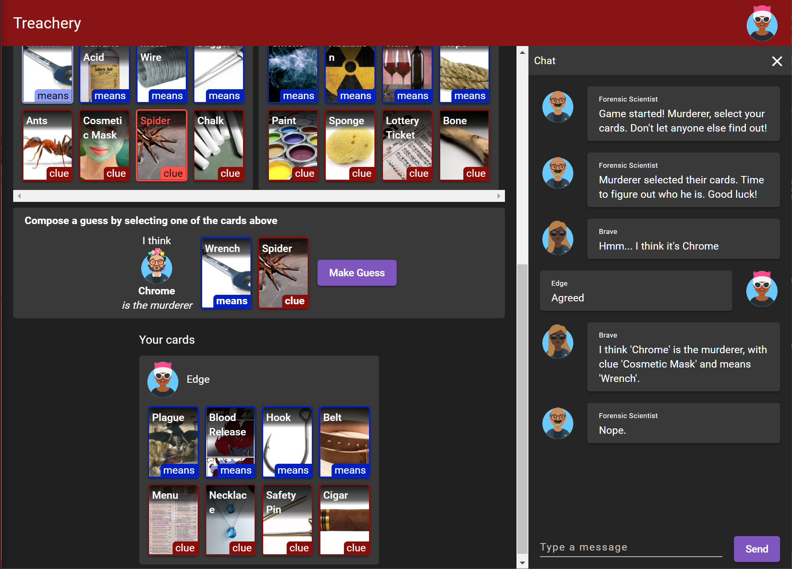

5. **Round 2 & 3**: For Round 2, the forensic Scientist will replace one of the cards. Everything else about this round is same as the previous round. Round 3 is similar to round 2, Forensic scientist will replace another card. You must submit your guess before the end of Round 3.

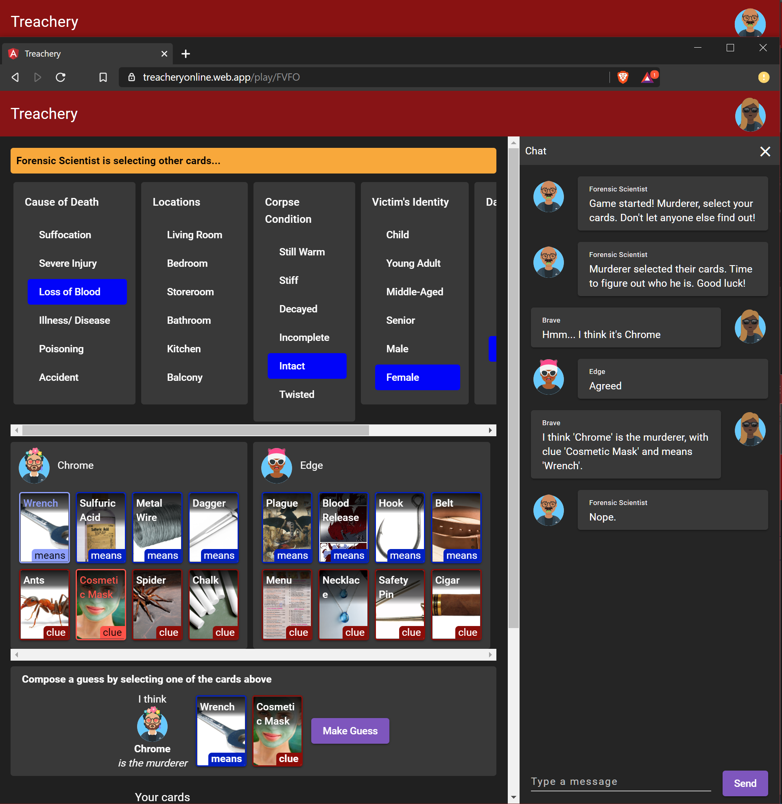

## Murderer

1. **You are the murderer**: You will be prompted to select a clue card and a means card. The forensic scientist will give out clues based on these selections, so select wisely. The game can only begin after you have made this selection.

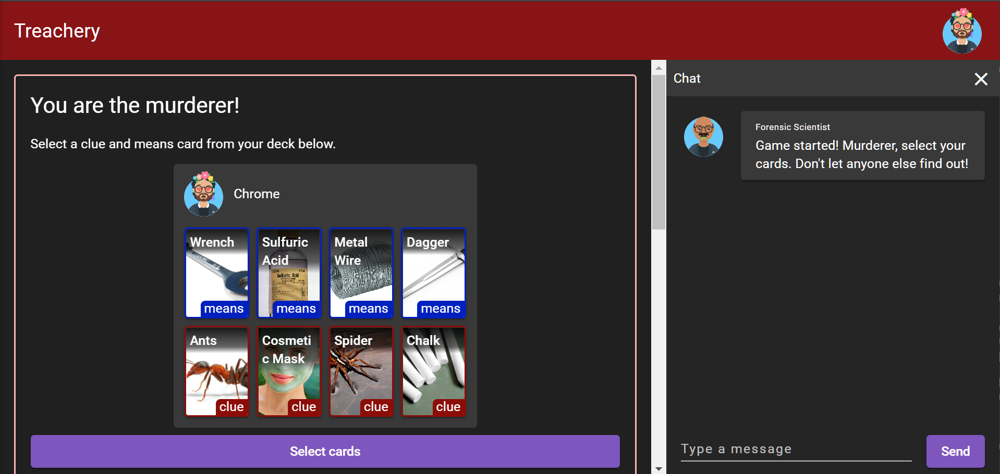

2. **Gameplay**: Throughout the rounds, your role is the same as the Investigators. You have to pose as one, and make sure no one suspects you. You can make one guess just like everyone else. If by the end of Round 3, no one has guessed correctly or guesses have expired for everybody else, you win!

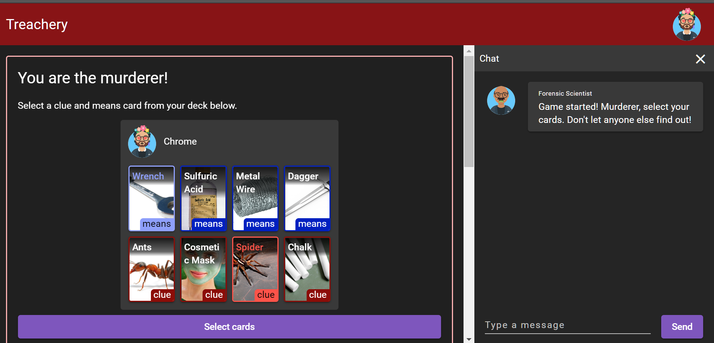

## Workflow
* Pushes to `master` go to production at https://treacheryonline.web.app 

